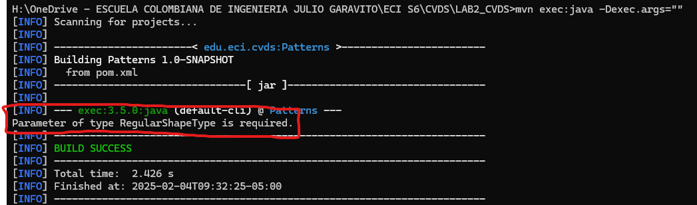
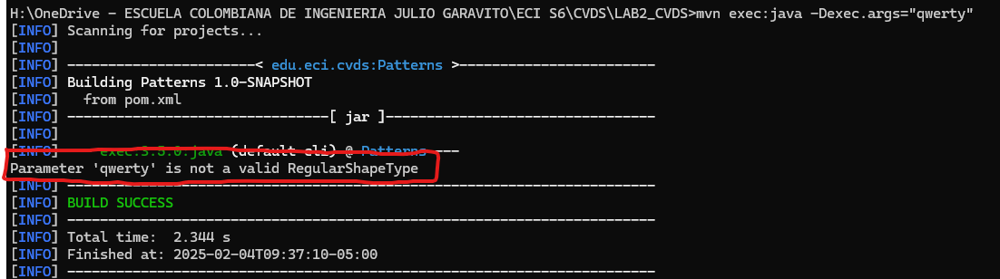
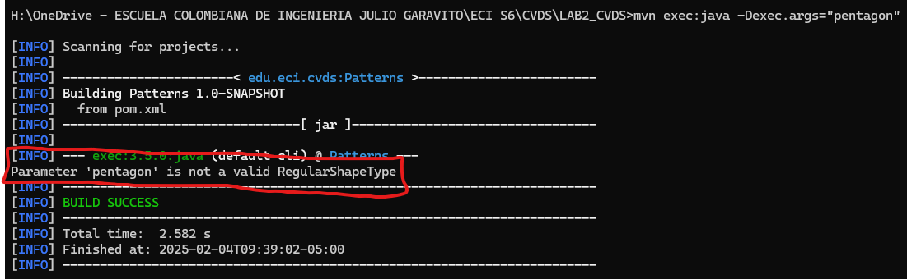
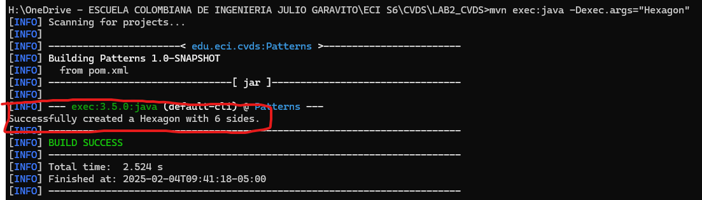

# CVDS Grupo No.3 | Laboratorio #2 - MAVEN PATTERNS FACTORY

### Enunciado Oficial: [LAB2 CVDS Company](https://github.com/CVDS-ESCUELAING/Laboratory2025/blob/main/LAB2.md)


### Integrantes
- Sergio Andrey Silva Rodríguez (Owner)
- Juan Esteban Lozano Cárdenas (Collaborator)


## EJERCICIO DE LAS FIGURAS
### CREAR UN PROYECTO CON MAVEN
- Buscar cómo se crea un proyecto maven con ayuda de los arquetipos (archetypes): 
- Busque cómo ejecutar desde línea de comandos el objetivo "generate" del plugin "archetype", con los siguientes parámetros:


```yml
ProjectId: org.apache.maven.archetypes:maven-archetype-quickstart:1.0
Id del Grupo: edu.eci.cvds
Id del Artefacto: Patterns
Paquete: edu.eci.cvds.patterns.archetype
```

Para realizarlo se usa el comando: (Referencia [Maven in 5 Minutes](https://maven.apache.org/guides/getting-started/maven-in-five-minutes.html)):

```sh
$ mvn archetype:generate -DgroupId=edu.eci.cvds -Dpackage=edu.eci.cvds.patterns.archetype -DartifactId=Patterns -DarchetypeArtifactId=maven-archetype-quickstart -DarchetypeVersion=1.5 -DinteractiveMode=false
```

Luego en la consola saldra Output de Maven instalando dependencias. Luego que termine se crea el Proyecto `Patterns`. Entrar al directorio con el comando

```sh
$ cd Patterns
```

Y ver la estructura del Proyecto maven con *tree*:
```sh
$ tree
```

Sale algo similar como:


## AJUSTAR ALGUNAS CONFIGURACIONES EN EL PROYECTO

Edite el archivo `pom.xml` y realize la siguiente actualización:

Hay que cambiar la version del compilador de Java a la versión 8, para ello, agregue la sección `properties` antes de la sección de
dependencias:
```xml
<properties>
  <maven.compiler.target>1.8</maven.compiler.target>
  <maven.compiler.source>1.8</maven.compiler.source>
</properties>
```

## COMPILAR Y EJECUTAR
Para compilar ejecute el comando:
```sh
$ mvn package
```

Si maven no actualiza las dependencias utilice la opción `-U` así:
```sh
$ mvn -U package
```

## EJERCICIOS
## 1. Busque cuál es el objetivo del parámetro "package" y qué otros parámetros se podrían enviar al comando `mvn`.

En Maven, el término *package* se refiere a una fase del ciclo de vida de construcción (y no a un parámetro en el sentido estricto) cuyo objetivo es empaquetar el proyecto en un archivo distribuible, como un `JAR`, `WAR`, `EAR`, etc. Esto significa que, al ejecutar el comando:

```sh
mvn package
```

Maven ejecutará, en orden, todas las fases previas necesarias (como `validate`, `compile` y `test`) y, una vez superadas, empaquetará el proyecto de acuerdo con la configuración especificada en el archivo `pom.xml`.


### Otras fases y comandos que se pueden usar con `mvn`
Maven está basado en un ciclo de vida que consta de varias fases. Algunas de las más comunes son:

- `validate`: Verifica que el proyecto esté correctamente configurado y que toda la información necesaria esté presente.
- `compile`: Compila el código fuente del proyecto.
- `test`: Ejecuta las pruebas unitarias usando frameworks como JUnit.
- `verify`: Realiza comprobaciones adicionales para asegurar que el paquete cumple con los criterios de calidad establecidos.
- `install`: Instala el paquete generado en el repositorio local, de modo que otros proyectos puedan utilizarlo como dependencia.
- `deploy`: Copia el paquete final a un repositorio remoto para que esté disponible para otros desarrolladores o sistemas de integración continua.
- `clean`: Elimina los archivos generados en compilaciones anteriores (generalmente el directorio target).
 
Además, existen otros comandos o goals asociados a plugins de Maven que se pueden invocar, por ejemplo:

- `mvn clean package`: Limpia los archivos generados previamente y luego empaqueta el proyecto.
- `mvn dependency:tree`: Muestra el árbol de dependencias del proyecto, lo que ayuda a identificar conflictos o dependencias transitivas.
- `mvn site`: Genera la documentación del proyecto.

### Parámetros adicionales

- `DskipTests`: Omite la ejecución de las pruebas durante el proceso de construcción.
Ejemplo: mvn install -DskipTests

- `P<nombrePerfil>`: Activa uno o más perfiles definidos en el pom.xml, lo que permite modificar la configuración del build para distintos entornos o propósitos.
Ejemplo: 
  ```sh
  mvn package -Pproduction
  ```

- `-e`: Muestra la traza completa de errores en caso de que ocurra alguno durante la construcción.

- `-X`: Activa el modo de depuración (debug), proporcionando información detallada que puede ser útil para solucionar problemas.


## 2. Busque cómo ejecutar desde línea de comandos, un proyecto maven y verifique la salida cuando se ejecuta con la clase `App.java` como parámetro en "mainClass". Tip: https://www.mojohaus.org/exec-maven-plugin/usage.html

### Configuración en el `pom.xml`

Para facilitar la ejecución, agregar (o verificar) la siguiente configuración en la sección `<build>` del `pom.xml`. Suponiendo que la clase principal se encuentre en el paquete adecuado (por ejemplo, com.ejemplo), la configuración sería:

``` xml
<build>
  <plugins>
    <plugin>
      <groupId>org.codehaus.mojo</groupId>
      <artifactId>exec-maven-plugin</artifactId>
      <version>3.1.0</version>
      <configuration>
        <!-- Colocar el nombre de clase totalmente calificado -->
        <mainClass>com.ejemplo.App</mainClass>
      </configuration>
    </plugin>
  </plugins>
</build>
```

### Ejecución desde la Línea de Comandos
- #### Usando la configuración del pom.xml
Ejecuta el siguiente comando para compilar y ejecutar la aplicación:

``` sh
mvn compile exec:java
```

Este comando:

- Ejecuta la fase `compile` (compila el código fuente).
- Llama al goal *exec:java* del plugin, que utiliza la propiedad mainClass definida en el `pom.xml` para invocar la clase principal.

### Especificando la clase principal desde la línea de comandos
Si se prefiere no modificar el pom.xml o se desea sobrescribir la configuración, ejecutar:
``` sh
mvn compile exec:java -Dexec.mainClass=com.ejemplo.App
```

Donde `com.ejemplo.App` se debe remplazar con el nombre de clase completamente calificado correspondiente al proyecto.

### Verificación de la Salida
Al ejecutar alguno de los comandos anteriores, Maven compilará el proyecto y lanzará la ejecución de la clase App. Por ejemplo, si el método main de App.java contiene:
``` java
public class App {
    public static void main(String[] args) {
        System.out.println("¡Hola, Maven!");
    }
}

``` 

La salida en la consola debería mostrar:

``` powershell 
[INFO] Scanning for projects...
[INFO] ------------------------------------------------------------------------
[INFO] Building MiProyecto 1.0-SNAPSHOT
[INFO] ------------------------------------------------------------------------
...
¡Hola, Maven!
...
``` 


## 3. Realice el cambio en la clase `App.java` para crear un saludo personalizado, basado en los parámetros de entrada a la aplicación. 

Para leer los argumentos de la línea de comandos y generar un saludo personalizado se usa el siguiente ejemplo en el archivo `App.java`:

``` java
public class App {
    public static void main(String[] args) {
        // Si se pasa al menos un argumento, se usará para el saludo.
        if (args.length > 0) {
            String nombre = args[0];
            System.out.println("¡Hola, " + nombre + "!");
            
        } else {
            System.out.println("¡Hola, mundo!");
        }
    }
}
```

### Explicación:

1) Se verifica si `args` contiene algún parámetro.

2) Si hay un parámetro, se asume que es el nombre que se desea saludar y se imprime: 
   ``` sh
   ¡Hola, [nombre]!
   ```
3) Si no se pasan argumentos, se muestra el saludo por defecto: 
   ```
   ¡Hola, mundo!
   ```


## 4. Utilizar la primera posición del parámetro que llega al método "main" para realizar elsaludo personalizado, en caso que no sea posible, se debe mantener el saludo como se encuentra actualmente:

### Ejecución con Parámetros

Ejecutar enviando como parametro de nombre: `Juan`
``` sh
mvn compile exec:java -Dexec.args="Juan"
```
Ejemplo:

### Ejecución sin Parámetros
Ejecutar de manera directa sin nombre alguno:
``` sh
mvn compile exec:java
```

Ejemplo:


## 5. Buscar cómo enviar parámetros al plugin "exec".

### Enviar parámetros desde la línea de comandos
Se especifican los argumentos que se pasarán al método *main* mediante la opción `-Dexec.args`. Por ejemplo, si se desea pasar dos parámetros, `param1` y `param2`, utilizar:
``` sh
mvn compile exec:java -Dexec.args="param1 param2"
```

### Configurar los parámetros directamente en el `pom.xml`

Si se prefiere definir los argumentos de forma fija en el archivo `pom.xml`, se hace dentro de la configuración del plugin usando la etiqueta `<arguments>`. Por ejemplo:

``` xml
<build>
  <plugins>
    <plugin>
      <groupId>org.codehaus.mojo</groupId>
      <artifactId>exec-maven-plugin</artifactId>
      <version>3.1.0</version>
      <configuration>
        <mainClass>com.ejemplo.App</mainClass>
        <arguments>
          <!-- Seccion para agregar parametros -->
          <argument>param1</argument>
          <argument>param2</argument>
        </arguments>
      </configuration>
    </plugin>
  </plugins>
</build>
```
Para ejecutar:
``` sh
mvn compile exec:java
```
El plugin utilizará los argumentos definidos en el `<arguments>`, pasando `param1` y `param2` a la aplicación.


## 6. Ejecutar nuevamente la clase desde línea de comandos y verificar la salida: Hello World!

Como el saludo es el predeterminado cuando no se envian parametros, entonces se ejecuta:

``` sh
mvn compile exec:java
```

Salida en consola:

``` ps1
[INFO] Scanning for projects...
[INFO] ------------------------------------------------------------------------
[INFO] Building MiProyecto 1.0-SNAPSHOT
[INFO] ------------------------------------------------------------------------
...
Hello World!
...
```
Al ejecutar el comando anterior, Maven compilará el proyecto y luego ejecutará la clase App. Dado que no se están pasando argumentos, se evaluará la condición en el método main y se mostrará el saludo predeterminado. La salida en la consola debería ser similar a:


## 7. Ejecutar la clase desde línea de comandos enviando su nombre como parámetro y verificar la salida. Ej: Hello Pepito!
### Compilar y ejecutar
El parametro de ejemplo es `Pepito`. Para ejecutar la aplicacion utilizar:

``` sh
mvn compile exec:java -Dexec.args="Pepito"
```
### Verificar la salida

`<SCREENSHOT>`


## 8. Ejecutar la clase con su nombre y apellido como parámetro. ¿Qué sucedió?
Como ejemplo:
- `Nombre`: Sergio
- `Apellido`: Silva

Ejecutar:
``` sh
mvn compile exec:java -Dexec.args="Sergio Silva"
```
Con este comando, Maven interpreta `"Sergio Silva"` como dos argumentos separados:

- `args[0]` → `"Sergio"`
- `args[1]` → `"Silva"`

### ¿Qué sucedió?

Dado que la lógica actual de la aplicación utiliza únicamente `args[0]`, la salida será:

``` sh
Hello Sergio!
```

## 9. Verifique cómo enviar los parámetros de forma "compuesta" para que el saludo se realice con nombre y apellido.

### Explicación de la salida
Para enviar un parámetro compuesto (es decir, que contenga espacios) y que sea interpretado como un único argumento (por ejemplo, `"Sergio Silva"`), se debe encerrar la cadena en comillas dobles escapadas. De esta forma, Maven pasará el parámetro completo a la aplicación.

### Codigo en `App.java`
```java
public class App {
    public static void main(String[] args) {
        if (args != null && args.length > 0 && args[0] != null && !args[0].trim().isEmpty()) {
            System.out.println("Hello " + args[0] + "!");
        } else {
            System.out.println("Hello World!");
        }
    }
}
```


## 10.   Ejecutar nuevamente y verificar la salida en consola. Ej: Hello Pepito Perez!

Si la lógica de la clase `App.java` está preparada para usar el primer argumento como saludo (por ejemplo, concatenando todo lo recibido en `args[0]`), el comando sería:
### Ejecución
El nombre como parametro es: `Pepito Perez`:
```sh
mvn compile exec:java -Dexec.args="\"Pepito Perez\""
```
### Salida
`SCREENSHOT`


## ESQUELETO DE LA APLICACIÓN

Cree el paquete `edu.eci.cvds.patterns.shapes` y el paquete `edu.eci.cvds.patterns.shapes.concrete`.

Cree una interfaz llamada `Shape.java` en el directorio `src/main/java/edu/eci/cvds/patterns/shapes` de la siguiente manera:
```java
package edu.eci.cvds.patterns.shapes;

public interface Shape {
    public int getNumberOfEdges();
}
```

Cree una enumeración llamada `RegularShapeType.java` en el directorio `src/main/java/edu/eci/cvds/patterns/shapes` así:

```java
package edu.eci.cvds.patterns.shapes;

public enum RegularShapeType {
    Triangle, Quadrilateral, Pentagon, Hexagon
}
```

En el directorio `src/main/java/edu/eci/cvds/patterns/shapes/concrete` cree las diferentes clases (Triangle, Quadrilateral, Pentagon, Hexagon), que implementen la interfaz creada y retornen el número correspondiente de vértices que tiene la figura. 

Siguiendo el ejemplo del triángulo:
```java
package edu.eci.cvds.patterns.shapes.concrete;

import edu.eci.cvds.patterns.shapes.Shape;

public class Triangle implements Shape {
    public int getNumberOfEdges() {
        return 3;
    }
}
```

NOTA: Para las otras 3 figuras Quadrilateral, Pentagon, Hexagon. Agregar esa estructura y esta funcion

### Quadrilateral
```java
public int getNumberOfEdges() {
    return 4;
}
```   

### Pentagon
```java
public int getNumberOfEdges() {
    return 5;
}
```   

### Hexagon
```java
public int getNumberOfEdges() {
    return 6;
}
```   

Cree el archivo `ShapeMain.java` en el directorio `src/main/java/edu/eci/cvds/patterns/shapes` con el metodo main:
```java
package edu.eci.cvds.patterns.shapes;

public class ShapeMain {

  public static void main(String[] args) {
    if (args == null || args.length != 1) {
      System.err.println("Parameter of type RegularShapeType is required.");
      return;
    }
    try {
      RegularShapeType type = RegularShapeType.valueOf(args[0]);
      Shape shape = ShapeFactory.create(type);
      System.out.println(
        String.format(
          "Successfully created a %s with %s sides.",
          type,
          shape.getNumberOfEdges()
        )
      );
    } catch (IllegalArgumentException ex) {
      System.err.println(
        "Parameter '" + args[0] + "' is not a valid RegularShapeType"
      );
      return;
    }
  }
}
```

Analice y asegúrese de entender cada una de las instrucciones que se encuentran en todas las clases que se crearon anteriormente. Cree el archivo `ShapeFactory.java` en el directorio `src/main/java/edu/eci/cvds/patterns/shapes` implementando el patrón fábrica (Hint: https://refactoring.guru/design-patterns/catalog), haciendo uso de la instrucción switch-case de Java y usando las enumeraciones.

¿Cuál fábrica hiciste? y ¿Cuál es mejor?


- Patron de Diseño elegido: `SimpleFactory`
- #### La mejor opcion:
  En este caso, la mejor opción para la implementación de *ShapeFactory.java* es `Simple Factory`, ya que nuestro objetivo es centralizar la creación de instancias de clases concretas (Triangle, Quadrilateral, Pentagon, Hexagon) basándonos en el tipo recibido como parámetro.

### Codigo de `ShapeFactory`

```java
package edu.eci.cvds.patterns.shapes;
import edu.eci.cvds.patterns.shapes.concrete.*;

public class ShapeFactory {
    public static Shape create(RegularShapeType type) {
        switch (type) {
            case Triangle:
                return new Triangle();
            case Quadrilateral:
                return new Quadrilateral();
            case Pentagon:
                return new Pentagon();
            case Hexagon:
                return new Hexagon();
            default:
                throw new IllegalArgumentException("Invalid shape type: " + type);
        } 

    }
}
```
### Ejecucion `ShapeMain` con Parámetros
Ejecute múltiples veces la clase ShapeMain, usando el plugin exec de maven con los siguientes parámetros y verifique la salida en consola para cada una:

### Configurar el `pom.xml`
Buscar donde esta la etiqueta *mainClass* y poner la ruta de `ShapeMain`
```xml
<configuration>
    <mainClass>edu.eci.cvds.patterns.shapes.ShapeMain</mainClass>
</configuration>
```

### Comandos
Como se modifico el `pom.xml` entonces toca recompilar el proyecto para que funcione:
```sh
mvn package
```

Ahora si ejecutar el programa:
```sh
mvn exec:java -Dexec.args="PARAMETRO"
```
Donde `PARAMETRO` es el parametro que se envia al main de *ShapeMain.java*

### Ejecuciones

- Sin parámetros



- Parámetro: qwerty



- Parámetro: pentagon



- Parámetro: Hexagon



¿Cuál(es) de las anteriores instrucciones se ejecutan y funcionan correctamente y por qué?
Deberia ejecutarse tal cual y como esta la clase como esta en el codigo.

1) Sin parametros el programa no puede crear ningun *Shape*
2) Con `qwerty` no funciono pues no existe un *Shape* con ese nombre
3) Con `pentagon` no funciono pues, aunque exista `Pentagon` como *Shape*, el programa no es sensible a mayusculas y minusculas. Entonces toca escribirlo con P mayuscula para que lo identifique
4) Con `Hexagon` si funciono pues es un `Shape` valido


## Preguntas Investigación

### Investigue para qué sirve "gitignore" y configurelo en su proyecto para evitar adjuntar archivos que no son relevantes para el proyecto.

### ¿Para qué sirve `.gitignore`?
El archivo `.gitignore` se utiliza para indicarle a Git qué archivos o directorios deben ser ignorados y no incluidos en el control de versiones. Esto ayuda a evitar subir archivos temporales, de compilación, logs y configuraciones locales de herramientas o IDEs, manteniendo el repositorio limpio y enfocado solo en el código fuente relevante.

### ¿Cómo configurar `.gitignore` en tu proyecto?
- Crear el archivo:
En la raíz del repositorio (donde se encuentra el pom.xml si es un proyecto Maven), crear un archivo llamado `.gitignore`.

- Agregar las reglas de exclusión:
Escribir dentro del archivo los patrones de los archivos y carpetas que se quieren ignorar. Por ejemplo, para un proyecto Java con Maven, se puede incluir:

``` py
# Directorio de salida de Maven
/target/

# Archivos de configuración de Maven Wrapper (si se usan)
!.mvn/wrapper/maven-wrapper.jar
!.mvn/wrapper/maven-wrapper.properties

# Configuraciones de IDEs y archivos de proyecto
# IntelliJ IDEA
.idea/
*.iml

# Eclipse
.classpath
.project
.settings/

# NetBeans
nbproject/private/

# Archivos de log y temporales
*.log
*.tmp

# Archivos del sistema operativo
.DS_Store
Thumbs.db
```

### Guardar y añadir al repositorio
Una vez configurado, guardar el archivo y realizar un commit:

``` sh
git add .gitignore
git commit -m "Agregar archivo .gitignore para excluir archivos no relevantes"
```

### Nota
Si ya se ha agregado al repositorio archivos que deberían ser ignorados, se deben eliminarlos del seguimiento de Git (sin borrarlos del disco) con el comando:

```sh
git rm --cached <archivo_o_directorio>
```