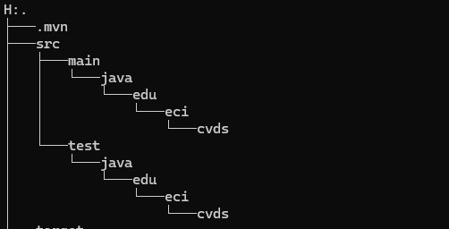

# CVDS G03 | Laboratorio #2 - MAVEN PATTERNS FACTORY

### Enunciado Oficial: [LAB2 CVDS Company](https://github.com/CVDS-ESCUELAING/Laboratory2025/blob/main/LAB2.md)

### Integrantes
- Sergio Andrey Silva (Owner)
- Juan Esteban Lozano (Collaborator)


## EJERCICIO DE LAS FIGURAS
### CREAR UN PROYECTO CON MAVEN
- Buscar cómo se crea un proyecto maven con ayuda de los arquetipos (archetypes): 
- Busque cómo ejecutar desde línea de comandos el objetivo "generate" del plugin "archetype", con los siguientes parámetros:


```yml
ProjectId: org.apache.maven.archetypes:maven-archetype-quickstart:1.0
Id del Grupo: edu.eci.cvds
Id del Artefacto: Patterns
Paquete: edu.eci.cvds.patterns.archetype
```

Para realizarlo se usa el comando: (Referencia [Maven in 5 Minutes](https://maven.apache.org/guides/getting-started/maven-in-five-minutes.html)):

```sh
$ mvn archetype:generate -DgroupId=edu.eci.cvds -Dpackage=edu.eci.cvds.patterns.archetype -DartifactId=Patterns -DarchetypeArtifactId=maven-archetype-quickstart -DarchetypeVersion=1.5 -DinteractiveMode=false
```

Luego en la consola saldra Output de Maven instalando dependencias. Luego que termine se crea el Proyecto `Patterns`. Entrar al directorio con el comando

```sh
$ cd Patterns
```

Y ver la estructura del Proyecto maven con *tree*:
```sh
$ tree
```

Sale algo similar como:


## AJUSTAR ALGUNAS CONFIGURACIONES EN EL PROYECTO

Edite el archivo `pom.xml` y realize la siguiente actualización:

Hay que cambiar la version del compilador de Java a la versión 8, para ello, agregue la sección `properties` antes de la sección de
dependencias:
```xml
<properties>
  <maven.compiler.target>1.8</maven.compiler.target>
  <maven.compiler.source>1.8</maven.compiler.source>
</properties>
```

## COMPILAR Y EJECUTAR
Para compilar ejecute el comando:
```sh
$ mvn package
```

Si maven no actualiza las dependencias utilice la opción `-U` así:
```sh
$ mvn -U package
```

## EJERCICIOS
1. Busque cuál es el objetivo del parámetro "package" y qué otros parámetros se podrían enviar al comando `mvn`.

2. Busque cómo ejecutar desde línea de comandos, un proyecto maven y verifique la salida cuando se ejecuta con la clase `App.java` como parámetro en "mainClass". Tip: https://www.mojohaus.org/exec-maven-plugin/usage.html

3. Realice el cambio en la clase `App.java` para crear un saludo personalizado, basado en los parámetros de entrada a la aplicación. 

4. Utilizar la primera posición del parámetro que llega al método "main" para realizar elsaludo personalizado, en caso que no sea posible, se debe mantener el saludo como se encuentra actualmente:

5. Buscar cómo enviar parámetros al plugin "exec".

6. Ejecutar nuevamente la clase desde línea de comandos y verificar la salida: Hello World!

7. Ejecutar la clase desde línea de comandos enviando su nombre como parámetro y verificar la salida. Ej: Hello Pepito!

8. Ejecutar la clase con su nombre y apellido como parámetro. ¿Qué sucedió?

9. Verifique cómo enviar los parámetros de forma "compuesta" para que el saludo se realice con nombre y apellido.

10. Ejecutar nuevamente y verificar la salida en consola. Ej: Hello Pepito Perez!
